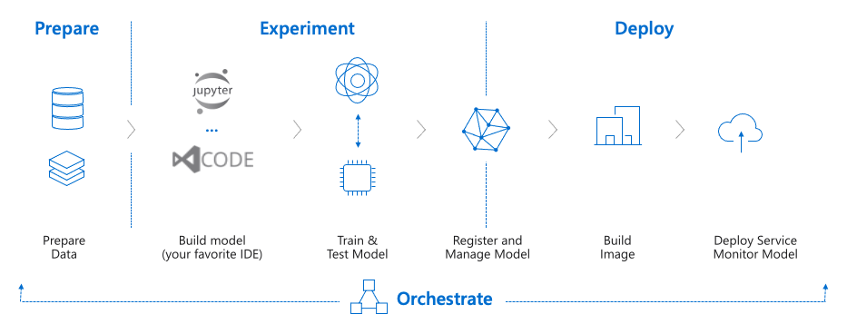
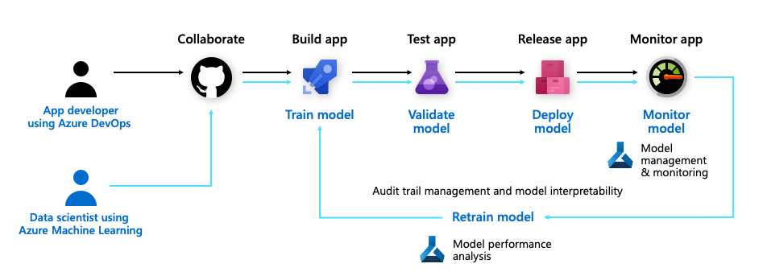

# mlops workshop
This workshop will guide you through the basics of Azure Machine Learning and focus on mlops.

## The use case
Consider you are a data scientist working on computer vision model. During research you reached good results and your business users are happy with such result. The model is deployed to an aks cluster, the sun is shining, the birds are singing, a dream.
However, you think you can do better, you dream of it, and you reach your home office one day, with a different approach, no one has ever attempted it. you run you local tests with the training and validation you got months back, the results you get are showing an improvement of 5-7% in accuracy, you feel on top of the world! your buddy at devops, answers your call, and asks you to provide him with your locally built image, you let him pull it from your local registry, he deploys it to production on a thursday afternoon. You go back to your living room, ready to bing 'The boys' since you feel on top of the world.

couple of minutes later, your phone rings, on the other side is your skip level manager, asking "what the..." happen to the production system? predictions are out of all thresholds. you spend the weekend rolling back your great idea, thinking and hoping it wont cost you your job.

Been there, afraid to be there? keep reading.

### whats wrong with the story?
1. Stale data set for training and testing
2. Missing production validation procedure 
3. Local image pushed to production environment 
4. All steps are manual, prone to failure and errors

## What is MLOps ?
MLOps, or DevOps for machine learning, enables data science and IT teams to collaborate and increase the pace of model development and deployment via monitoring, validation, and governance of machine learning models.

### And what can be done differently?

## Software Components
Our problem in this scenario is the computer vision 101, or the bellow world of cv. mnist - classification of hand written digits. as part of the workshop, you will be able to either create your own model, or download and use and existing one, the goal here is not to learn how to create models or improve them, rather how to orchestrate the science of deploying it correctly. 

### Models
Sample model [see here](https://pipelinedata.blob.core.windows.net/mnist-model/mnist-tf.tar.gz)
You can also train your own model see examples [here](https://docs.microsoft.com/en-us/azure/machine-learning/tutorial-train-models-with-aml)

### Data
Well, you can start writing digits till hte cows come home, or use this [link](https://github.com/myleott/mnist_png)

### Azure Machine Learning
start [here](https://docs.microsoft.com/en-us/azure/machine-learning/tutorial-1st-experiment-sdk-setup)
We will be using [Data Store](https://docs.microsoft.com/en-us/azure/machine-learning/how-to-access-data)

#### Managed Identity
When submitting an experiment (of any type) to an AML cluster, one needs to take into consideration the authorization required to access the data. in a nutshell, it is highly recommended to use minimal authorization on data elements. always look for the minimal granted access. The cluster will be using either a system assigned identity or if you associate a user managed identity. I had successful data access using the [user managed identity](https://docs.microsoft.com/en-us/azure/active-directory/managed-identities-azure-resources/how-to-manage-ua-identity-portal).

#### DataStore & Dataset 
DataStore are references to multi type of storage repository, starting from databases, blob storage files and more. With datasets, you can:
- Keep a single copy of data in your storage, referenced by datasets.
- Seamlessly access data during model training without worrying about connection strings or data paths.Learn more about how to train with datasets.
- Share data and collaborate with other users.

### ML Taxonomy 
For reference, there are multiple modules in play, here is a diagram, showing them all in one

Ready to [start](workshop.md)? 