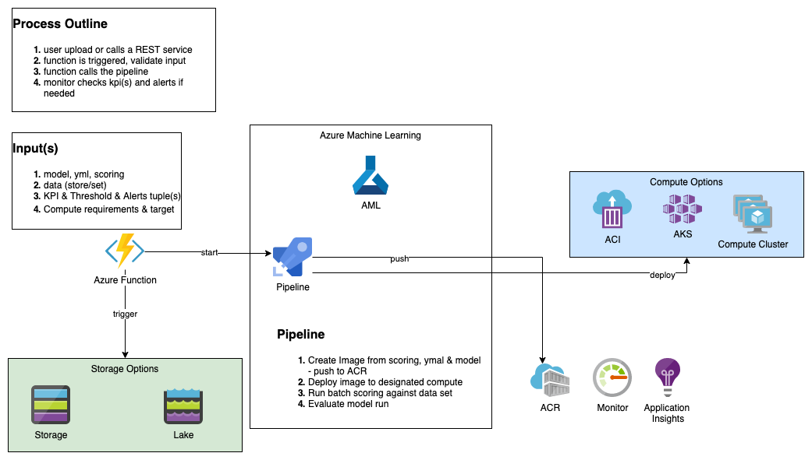

# Goals
At the end of this workshop you will be able to:
- Create data store and data sets
- Create notebook VM
- Create Compute Cluster
- Create / Download mnist model & register it
- Create pipeline and run it
- Enhance the pipeline, add parameters
- Call the pipeline, either manually or systematically 

# Initial Steps
## Workspace
Create your workspace - visit these [instruction](https://docs.microsoft.com/en-us/azure/machine-learning/concept-azure-machine-learning-architecture)

It is recommended to experiment with the sample notebooks. These notebooks provide good view on capabilities. Having said that the AML SDK is not covered fully in the examples. For further information on the [SDK](https://docs.microsoft.com/en-us/python/api/overview/azure/ml/?view=azure-ml-py) and [samples](https://github.com/Azure/MachineLearningNotebooks)

## The end game - Diagram

### Inputs
The inputs to the process, are with few domains:
- model (with scoring, yml)
- the data reference (could be decided as constant for all pipeline runs)
- the desired behavior (KPIs)
- the compute needs/request
### Process Flow
As in our context, you are a data scientist looking to verify your new model, for that you worked outside the scope of this workshop and created a model.
Your model, is constructed of 3 files, including the model itself, the scoring file, and a yml file listing the required packages. 
Upon a submission of new model with all* required data, the pipeline will execute:
- image creation & push to registry based on the yml, model and scoring file (your metrics should be logged as part of the scoring file)
- deploy created image to designated compute (AKS, ACI, Compute Cluster)
- run the batch scoring, taking the right metrics
- evaluate the run, notify originator of the outcome

#### Implementation Note
You can decide to implement part of the requirements. 
For example you can decide that the verification data is constant, and should not be provided as parameter, same for the compute or KPIs.

#### Sample notebook
The notebook available within this repo, is addressing the baseline for such process. it is expected to be enhanced.